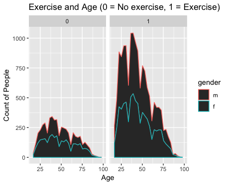
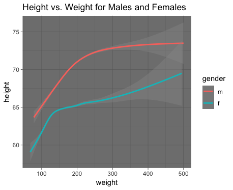
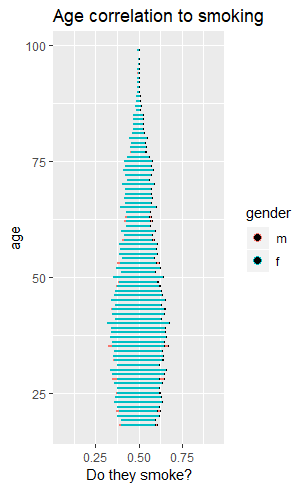
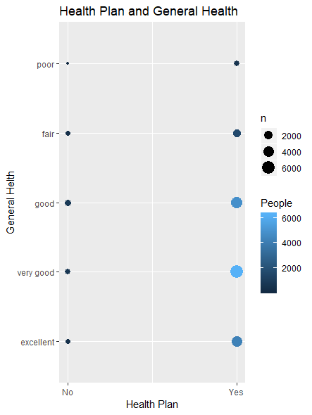

```{r setup, include=FALSE}
knitr::opts_chunk$set(echo = TRUE)
library(tidyverse)
```
## Team Question
__Overall Question__: What are the differences between different ages and genders in the amount of exercise per month?

__Why it is important__: There are many generational differences between people. Even now we see younger generations smoking less than the older ones (see Chris's graph). In order to better prepare all generations for a healthier life, we first need to see the differences between different ages' exercise habits. This will help us make recommendations to both parents of children and health care providers to help increase the overall health of all people.
Findings:
<<<<<<< HEAD
=======
```{r setup, include=FALSE}
ggplot(data=cdc,aes(x=age,color=gender))+geom_area(stat="bin")+facet_wrap(~exerany)+labs(x='Age',y='Count of People',title='Exercise and Age (0 = No exercise, 1 = Exercise)')
```
>>>>>>> master
Recomendations:

__Findings__:


ggplot(data=cdc,aes(x=age,color=gender))+geom_area(stat="bin")+facet_wrap(~exerany)+
labs(x='Age',y='Count of People',title='Exercise and Age (0 = No exercise, 1 = Exercise)')

In this plot, we can see that more people around the age range of 25-50 exercise than not. We can also see that over the age of 35-40, the number of people who both do and do not exercise decreases.  

__Conclusion__: From this plot, we can conclude that while most people do exercise, the largest group of people who do not exercise is between ages 35-40. 

__Recommendations__: From this graph, we can see, on average, people of all ages exercice more than they do not. However, there are still a large number of people, particularly around the ages of 30-45, who do not exercise. From this finding, we recommend for doctors and general practitioners to focus on individuals within that age range in order to increase the number of people who exercise. 

## Height, Weight, and Gender(James)


Because height and weight are both continuous variables, I used the smooth geom. This allowed me to see the clear relationship between height and weight, and how the slope varies as a function of weight. Some noticeable features are that the height for both men and women tend to approach an asymptote. I believe that this is best explained by the fact that humans reach a peak in their height, but can continue to put on weight. One other interesting aspect is how the slope varies. Initially, for both men and women, the slope is steep, but as weight increases, the slope decreases some.  

## Weight,  Weight Desire, and Gender(Amanda)


ggplot(data=cdc, mapping = aes(x=gender, y=weight-wtdesire, color = gender)) + geom_boxplot() +
 labs(x='Gender', y= 'Pounds Above Desired Weight', title = 'Distance to Desired Weight Based on Gender') + 
 coord_flip()

I used the boxplot geom to create two separate boxplots--one for each gender, and I looked at how far people tend to be from
 Itheir desired weight. The x-axis is represented by weight minus desired weight, so positive numbers indicate that a person is above their 
 desired weight. I also switched the coordinates of the boxplot so it would be easier to read, in addition to the label function in order to give
 the graph a title and labels on both axes. 
 The information on the graph suggests that 75% of both males and females from the study seem to be above their desired weight.
 More females tended to be farther away from their desired weight than males.

## Smoke and Age (Chris)



## Anna can you copy and paste my code here please? thank youuuu (:)

I created a plot showing how age and smoking are related and how this is segmented by gender. 
The data showed a few things: first that there were a lot more females than males in the sampled population and 
second that there were larger groups of people who smoked in the age range of about 35-50. 
It also showed that a much larger proportion of the age group of 60-75 were smokers. 
Finally, it showed that those over the age of 80 were primarily non-smokers. 
I used the geom_dotplot function and adjusted the color of the points to reflect the gender of the person behind 
the point in question. In addition, I adjusted the size of the points in the dotplot to be significantly smaller to handle
 the bulk of data; the default size was much too large. I also changed the default labels to make the plot easier 
 to read.


## General Health and Health Plan (Anna)
 

ggplot(data=cdc,aes(x=hlthplan,y=genhlth))+
      geom_count(aes(color=..n..))+
      labs(x='Health Plan', y='General Helth', title= 'Health Plan and General    Health',color='People')+
      scale_x_continuous(breaks=c(0,1),labels=c('No','Yes'))

I used the geom_count() function to plot the genhlth and hlthplan variables. I chose to use this plot because the data only contained 10 unique options (hlthplan, although represented numerically, only had two responses). By grouping the same points together, one can better see the relationship between an assessment of general health and whether or not an individual has a health plan or not. 

To better represent this data, I found a way to both aesthetically mark the amount of individuals represented in a data point by color and size. I also renamed the legend to better label the data. 

The overall finding I was able to see from this graph is that on average, there are more people who have a health plan than who do not and those people have an overall better general than those who do not.
